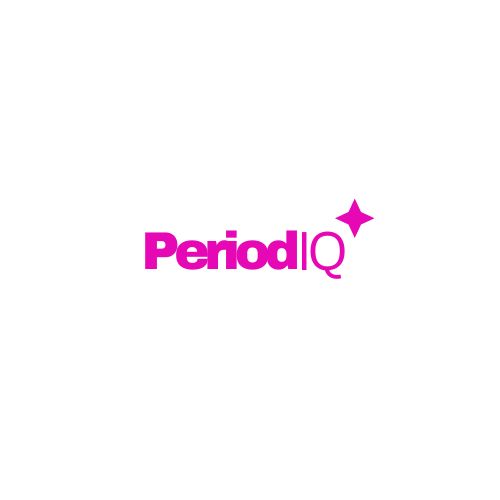

# PeriodIQ ✨

  

🌸 PeriodIQ - Empowering Women Through Smarter Menstrual Health 🌸

# Smarter Menstrual Health Tracking

## 🚀 About PeriodIQ 

**PeriodIQ** is a menstrual health tracking app designed to help women monitor their menstrual cycles, track symptoms, and gain insights into their health. Our goal is to make period tracking intuitive, informative, and accessible—including for users with basic feature phones.

## 🔥 Key Features

- **📝 Symptom Journal:** Log and track 10+ menstrual symptoms, including cramps, mastalgia, and mood changes.
- **📊 Data Insights:** View a graphical overview of your symptoms over any timeline (bar charts for easy visualization).
- **👥 Partner Sharing:** Option to share health summaries with a partner or spouse.
- **🤖 Smart Chatbot:** Get menstrual and general health guidance in **five African languages(more languages loading...)**.
- **💊 Painkiller Tracker:** Keep a record of pain relief medication used during periods.

## 🎯 Future Plans

Our team is dedicated to expanding **PeriodIQ** based on user feedback. Planned updates include:
- **📱 Support for Feature Phones:** Making **PeriodIQ** accessible to users with basic mobile devices.
- **📌 Additional Features:** More tracking options and integrations based on community suggestions.

## 🌍 Why PeriodIQ Matters

Many girls and women across Africa struggle with menstrual health challenges due to a lack of awareness and access to proper tracking tools. PeriodIQ empowers users with knowledge, making it easier to manage cycles, recognize health patterns, and improve well-being.

## 🛠️ Built With

  
  
  
  
  
  

## 📧 Contact
For questions, suggestions, or collaboration, feel free to reach out:
- **Twitter:** [@Gilcare_](https://x.com/Gilcare_?t=TBD_6_Y_s2yPBrjH5cP14A&s=08)
- **Website:** [PeriodIQ](https://periodiq.streamlit.app/)

---

  <b>Not just care-Gilcare💜</b>

